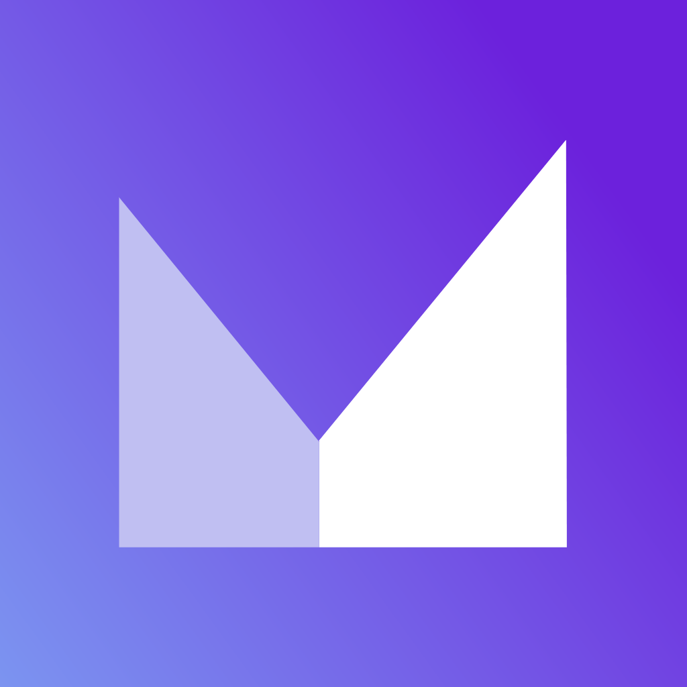
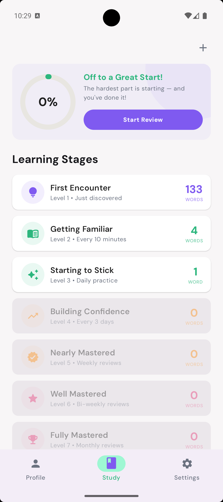
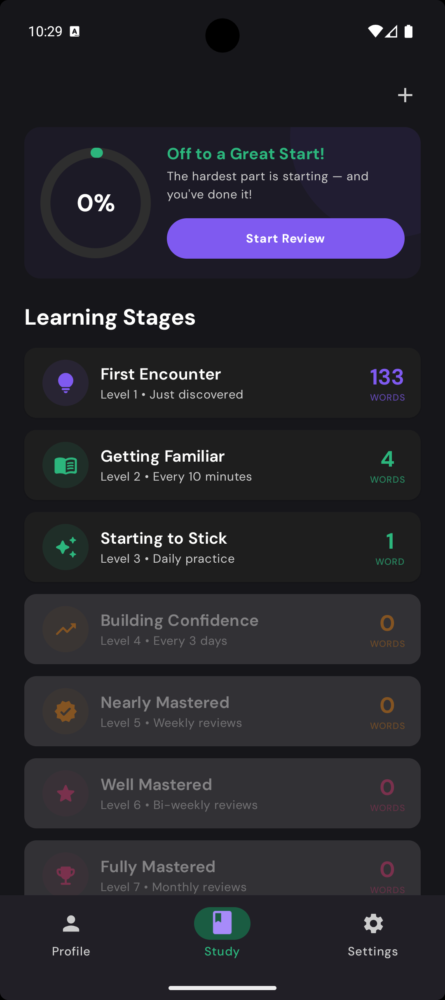
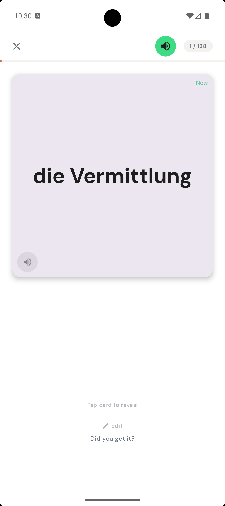
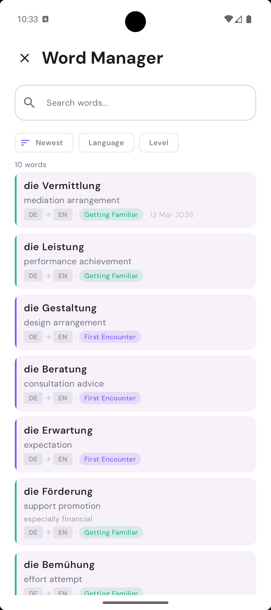
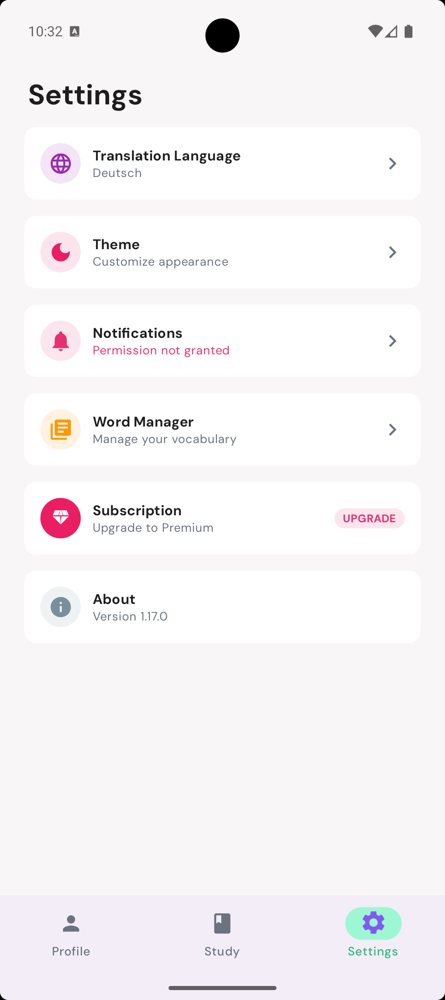
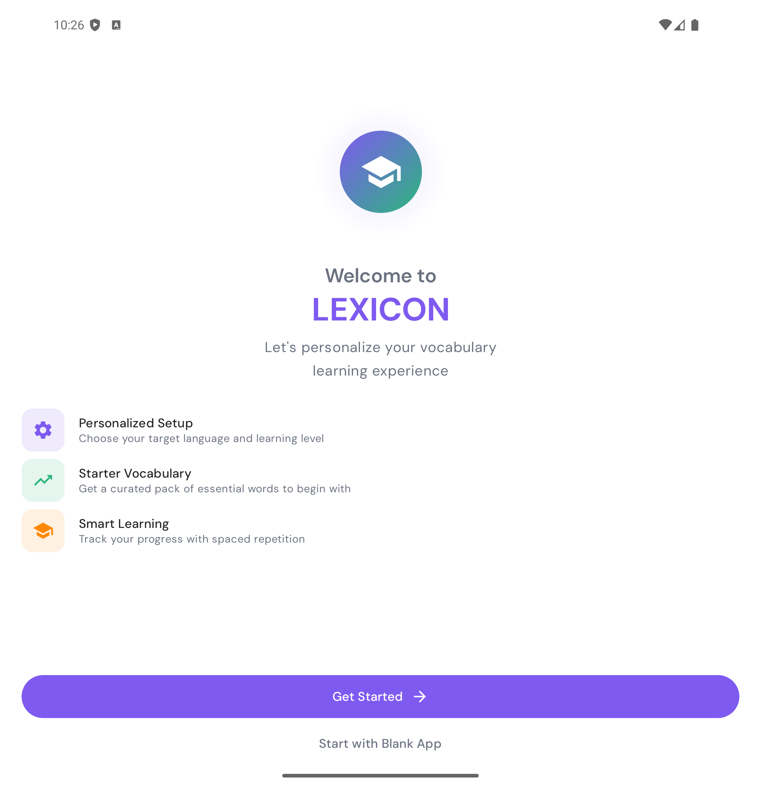
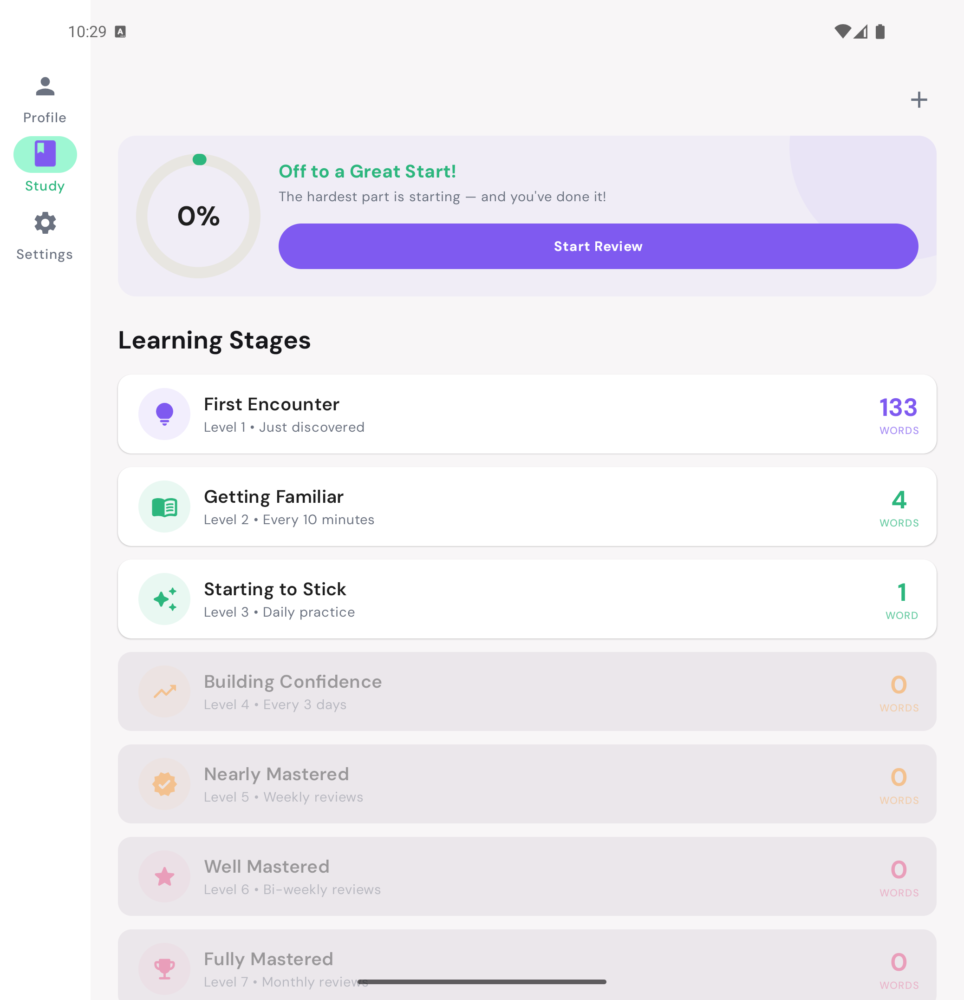

<p align="center">
  
</p>

<h1 align="center">Lexicon</h1>

<p align="center">
  A Kotlin Multiplatform vocabulary learning app targeting <b>Android</b>, <b>iOS</b>, and <b>Web (Kotlin/Wasm)</b>.<br/>
  Built with Compose Multiplatform, Clean Architecture, and Event Sink MVVM.
</p>

<p align="center">
  <a href="https://play.google.com/store/apps/details?id=com.alirezaiyan.vokab"></a>
  <a href="https://apps.apple.com/us/app/lexicon-learn-vocabulary/id6753774009"></a>
</p>

---

## Screenshots

### Phone

<div align="center">
<table>
  <tr>
    <td align="center"><b>Study (Light)</b></td>
    <td align="center"><b>Study (Dark)</b></td>
    <td align="center"><b>Flashcard Review</b></td>
    <td align="center"><b>Word Manager</b></td>
    <td align="center"><b>Settings</b></td>
  </tr>
  <tr>
    <td></td>
    <td></td>
    <td></td>
    <td></td>
    <td></td>
  </tr>
</table>
</div>

### Foldable / Tablet

<div align="center">
<table>
  <tr>
    <td align="center"><b>Onboarding</b></td>
    <td align="center"><b>Study Dashboard</b></td>
  </tr>
  <tr>
    <td></td>
    <td></td>
  </tr>
</table>
</div>

### Demo

<p align="center">
  <video src="assets/Screen_recording_20260313_103157.webm" width="250" controls></video>
</p>

---

## Features

- **Study Dashboard** — Track learning progress with vocabulary stats, progress ring, distribution bar, and learning stage breakdown
- **Flashcard Review** — Spaced-repetition flashcards with tap-to-flip, recall rating, and completion tracking
- **Import Words** — Type words manually with translations/descriptions, or import from `.txt` files
- **AI-Powered Import** — AI-generated vocabulary by target language, proficiency level, and topic
- **Word Manager** — Browse, search, edit words, and track mastery levels
- **Offline TTS** — Text-to-speech pronunciation for 13 languages (Sherpa ONNX / Piper models)
- **Profile & Leaderboard** — Learning streaks, weekly activity, and leaderboard
- **Subscriptions** — RevenueCat-powered premium features
- **Onboarding** — Language selection, proficiency level, and AI-generated starter vocabulary

<!--
  To generate demo recordings: ./maestro/record_showcase.sh
  See maestro/flows/showcase/ for individual flow definitions.
-->

## Module Architecture

```
composeApp        App entry point, DI graph (Koin), platform hooks
presentation      Compose screens, ViewModels, navigation, UI state
domain            Use cases + domain models (pure Kotlin)
data              Repository implementations, SQLDelight DB, Ktor data sources
core              HTTP client, Try<T>, BaseViewModel, UiState, OnEvents
platforms         Platform-specific bridges (Firebase, notifications, secure storage)
design-system     Reusable Compose components and theming
resources         Compose Multiplatform strings and assets
utils             Shared helper functions
test              Shared test utilities
build-logic       Custom Gradle convention plugin
iosApp            Swift iOS entry point
```

**Data flow:** View → ViewModel → UseCase → Repository → DataSource

## Build & Run

```bash
# Android debug APK
./gradlew composeApp:assembleDebug

# iOS framework (simulator)
./gradlew composeApp:linkDebugFrameworkIosSimulatorArm64

# Web (Kotlin/Wasm dev server)
./gradlew composeApp:wasmJsBrowserDevelopmentRun

# Compile common (shared) Kotlin code
./gradlew composeApp:compileKotlinMetadata
```

## Testing

```bash
# Run all common unit tests
./gradlew composeApp:cleanAllTests composeApp:allTests

# Android unit tests only
./gradlew composeApp:testDebugUnitTest

# Web browser tests
./gradlew composeApp:wasmJsBrowserTest
```

## Setup

1. Copy `local.defaults.properties` to `local.properties`
2. Fill in backend URL, Google OAuth client IDs, RevenueCat keys, and signing config
3. For iOS builds, run `./scripts/sync-ios-config.sh`

## Tech Stack

| Area              | Technology                                                                                                                                    |
| ----------------- | --------------------------------------------------------------------------------------------------------------------------------------------- |
| **Language**      | [Kotlin](https://kotlinlang.org/) 2.3.0                                                                                                      |
| **UI**            | [Compose Multiplatform](https://www.jetbrains.com/compose-multiplatform/) 1.10.2                                                              |
| **Targets**       | Android (minSdk 24), iOS, Web (wasmJs)                                                                                                        |
| **DI**            | [Koin](https://insert-koin.io/) 4.1.1                                                                                                        |
| **Database**      | [SQLDelight](https://cashapp.github.io/sqldelight/) 2.3.1 (multiplatform)                                                                    |
| **Networking**    | [Ktor](https://ktor.io/) 3.4.0 (auth interceptor + auto token refresh on 401/403)                                                            |
| **Auth**          | [KMPAuth](https://github.com/nicefivezerofour/KMPAuth) + [Firebase Auth](https://firebase.google.com/docs/auth) (Google OAuth, Apple Sign-In) |
| **Subscriptions** | [RevenueCat](https://www.revenuecat.com/) KMP                                                                                                |
| **Navigation**    | [androidx.navigation-compose](https://developer.android.com/develop/ui/compose/navigation) with bottom tabs                                   |
| **Image Loading** | [Coil](https://coil-kt.github.io/coil/) 3.4.0                                                                                               |
| **TTS**           | [Sherpa ONNX](https://github.com/k2-fsa/sherpa-onnx) (Piper models, 13 languages, offline)                                                   |
| **Analytics**     | [Firebase Analytics](https://firebase.google.com/docs/analytics) + [Crashlytics](https://firebase.google.com/docs/crashlytics)                |
| **Testing**       | [Turbine](https://github.com/cashapp/turbine), kotlin-test, coroutines-test                                                                   |
| **Static Analysis** | [Detekt](https://detekt.dev/) 1.23.8                                                                                                       |
| **CI/CD**         | GitHub Actions (`build.yml`, `test.yml`)                                                                                                      |

## App Flow

```
Splash → [authenticated?] → Main App (tabs)
       → [not authenticated] → Auth Gate (Google/Apple sign-in)
                              → Onboarding (language, level)
                              → Vocabulary Preview (import suggestions)
                              → Main App
```

## Documentation

Detailed docs live in [`doc/`](doc/INDEX.md):

- [`file-map.md`](doc/file-map.md) — Find any file by feature
- [`api-endpoints.md`](doc/api-endpoints.md) — All backend API endpoints
- [`spaced-repetition.md`](doc/spaced-repetition.md) — 7-bucket SRS algorithm
- [`di-setup.md`](doc/di-setup.md) — Koin module organization
- [`auth-flow.md`](doc/auth-flow.md) — Login, token refresh, logout flows
- [`architecture-vision.html`](doc/architecture-vision.html) — Current vs target architecture with migration roadmap

## Version Management

```bash
./scripts/bump-version.sh --hotfix   # patch bump
./scripts/bump-version.sh --minor    # minor bump
./scripts/bump-version.sh --major    # major bump
```
