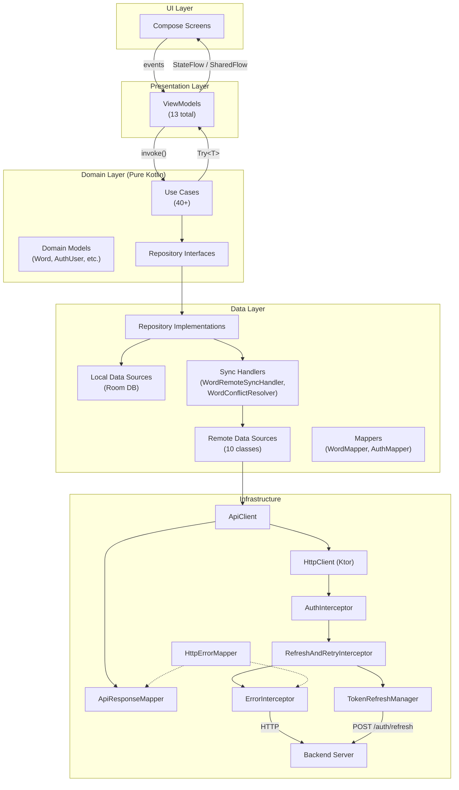
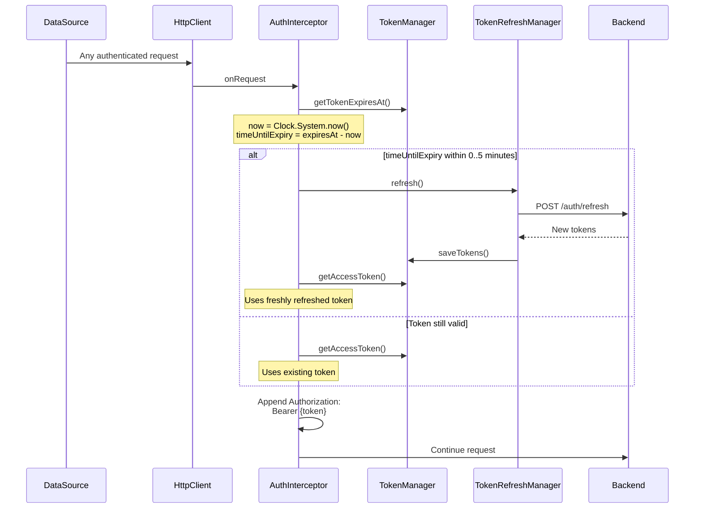
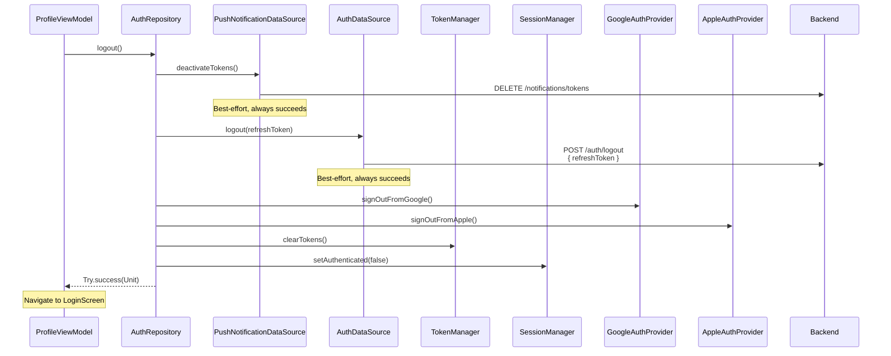
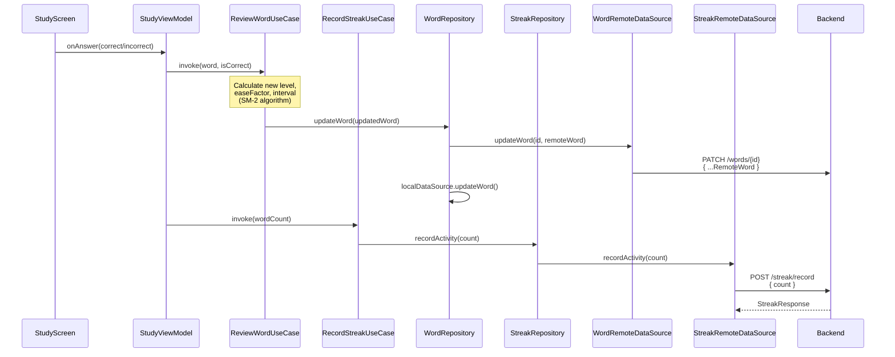
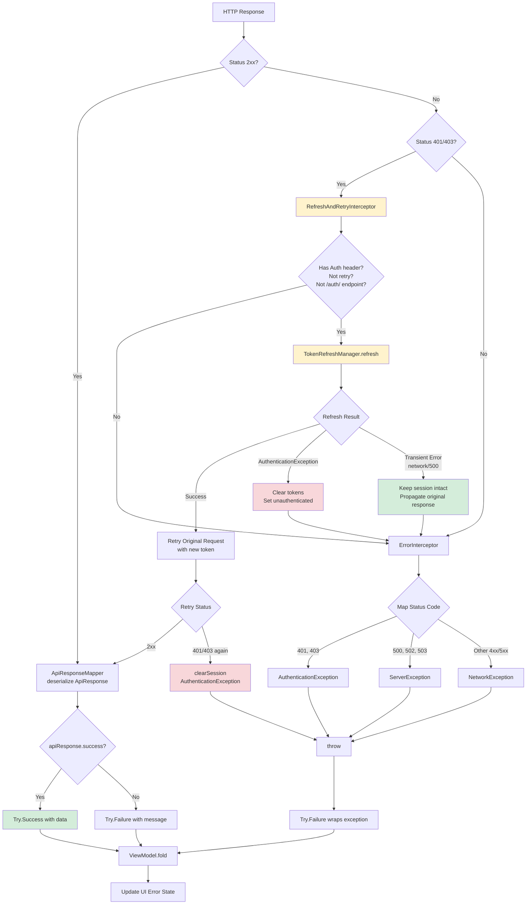
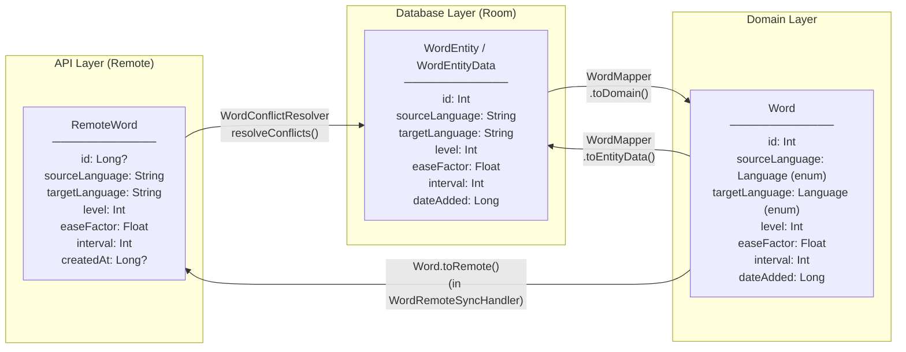
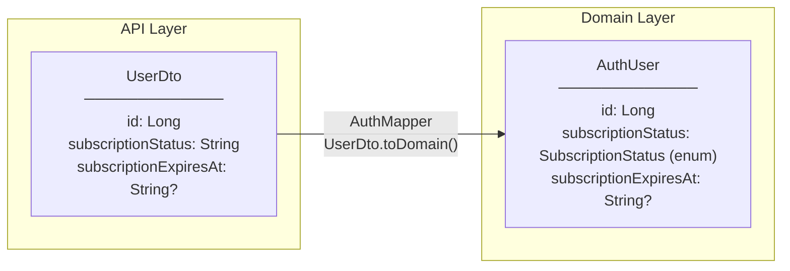
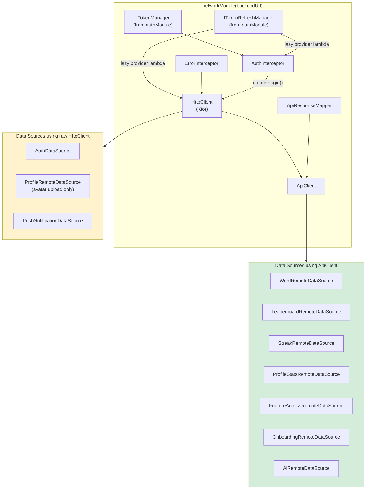
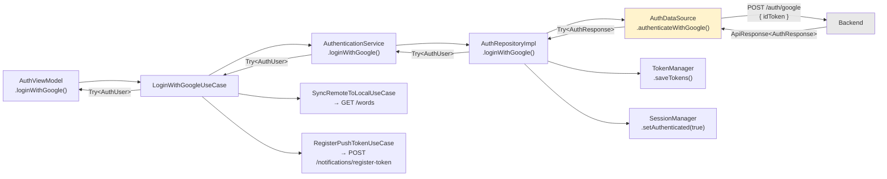
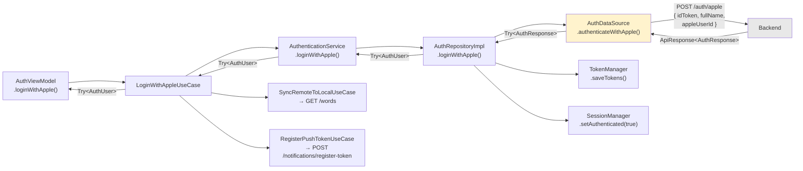

# API Architecture — Lexicon

Comprehensive mapping of all API calls, their flows through architecture layers, interceptor chains, auth lifecycle, sync patterns, error handling, and data mapping. Designed as input for AI visualization tools to generate professional diagrams.

---

## 1. High-Level Architecture



### Layer Responsibilities

| Layer | Transport | Key Types |
|-------|-----------|-----------|
| UI → Presentation | Compose events / lambdas | UI events, click handlers |
| Presentation → Domain | `suspend` calls | `Try<T>`, `Flow<T>` |
| Domain → Data | Repository interfaces | Domain models (`Word`, `AuthUser`) |
| Data → Infrastructure | `ApiClient` / `HttpClient` | DTOs (`RemoteWord`, `AuthResponse`) |
| Infrastructure → Backend | HTTPS (JSON) | `ApiResponse<T>` envelope |

---

## 2. Complete Endpoint Inventory (24 Endpoints)

### 2.1 Auth (6 endpoints)

| # | Method | Path | Auth | Request DTO | Response DTO | Data Source |
|---|--------|------|------|-------------|--------------|-------------|
| 1 | POST | `/auth/google` | No | `GoogleAuthRequest` | `ApiResponse<AuthResponse>` | `AuthDataSource` |
| 2 | POST | `/auth/apple` | No | `AppleAuthRequest` | `ApiResponse<AuthResponse>` | `AuthDataSource` |
| 3 | POST | `/auth/refresh` | No | `RefreshTokenRequest` | `ApiResponse<AuthResponse>` | `AuthDataSource` |
| 4 | POST | `/auth/logout` | Yes | `RefreshTokenRequest` | — (best-effort) | `AuthDataSource` |
| 5 | GET | `/users/me` | Yes | — | `ApiResponse<UserDto>` | `AuthDataSource` |
| 6 | DELETE | `/auth/delete-account` | Yes | — | — | `AuthDataSource` |

**Source:** `data/src/commonMain/kotlin/data/auth/remote/AuthDataSource.kt`

> **Note:** `AuthDataSource` uses raw `HttpClient` (not `ApiClient`) because auth endpoints bypass the interceptor chain for login/refresh.

#### DTOs

```json
// GoogleAuthRequest
{ "idToken": "string" }

// AppleAuthRequest
{ "idToken": "string", "authorizationCode": "string?", "fullName": "string?", "appleUserId": "string?" }

// RefreshTokenRequest
{ "refreshToken": "string" }

// AuthResponse
{
  "accessToken": "string",
  "refreshToken": "string",
  "tokenType": "string",
  "expiresIn": "long (ms)",
  "user": {
    "id": "long",
    "email": "string",
    "name": "string",
    "subscriptionStatus": "string (FREE|TRIAL|ACTIVE|EXPIRED|CANCELLED)",
    "subscriptionExpiresAt": "string?",
    "currentStreak": "int",
    "displayAlias": "string?",
    "profileImageUrl": "string?"
  }
}

// UserDto (same as user field in AuthResponse)
```

### 2.2 Feature Access (1 endpoint)

| # | Method | Path | Auth | Request DTO | Response DTO | Data Source |
|---|--------|------|------|-------------|--------------|-------------|
| 7 | GET | `/users/feature-access` | Yes | — | `FeatureAccessResponse` | `FeatureAccessRemoteDataSource` |

**Source:** `data/src/commonMain/kotlin/data/auth/remote/FeatureAccessRemoteDataSource.kt`

> Uses `ApiClient.getFlowNotNull`. Falls back to `{ pushNotificationsEnabled: true, hasPremiumAccess: false }` on any error.

#### DTO

```json
// FeatureAccessResponse (domain model, used directly — no mapping needed)
{
  "featureFlags": { "pushNotificationsEnabled": "boolean" },
  "userAccess": { "hasPremiumAccess": "boolean" }
}
```

### 2.3 Words (6 endpoints)

| # | Method | Path | Auth | Request DTO | Response DTO | Data Source |
|---|--------|------|------|-------------|--------------|-------------|
| 8 | GET | `/words` | Yes | — | `List<RemoteWord>` | `WordRemoteDataSource` |
| 9 | POST | `/words` | Yes | `UpsertWordsPayload` | — | `WordRemoteDataSource` |
| 10 | PATCH | `/words/{id}` | Yes | `RemoteWord` | — | `WordRemoteDataSource` |
| 11 | DELETE | `/words/{id}` | Yes | — | — | `WordRemoteDataSource` |
| 12 | POST | `/words/batch-delete` | Yes | `{ "ids": [long] }` | — | `WordRemoteDataSource` |
| 13 | POST | `/words/batch-update` | Yes | `BatchUpdateLanguagesRequest` | — | `WordRemoteDataSource` |

**Source:** `data/src/commonMain/kotlin/data/word/remote/WordRemoteDataSource.kt`

#### DTOs

```json
// RemoteWord
{
  "id": "long?",
  "originalWord": "string",
  "translation": "string",
  "description": "string",
  "sourceLanguage": "string (language code)",
  "targetLanguage": "string (language code)",
  "level": "int",
  "easeFactor": "float",
  "interval": "int",
  "repetitions": "int",
  "lastReviewDate": "long (epoch ms)",
  "nextReviewDate": "long (epoch ms)",
  "createdAt": "long? (epoch ms)"
}

// UpsertWordsPayload
{ "words": [ RemoteWord, ... ] }

// BatchUpdateLanguagesRequest
{ "ids": ["long"], "sourceLanguage": "string?", "targetLanguage": "string?" }
```

### 2.4 Profile (3 endpoints)

| # | Method | Path | Auth | Request DTO | Response DTO | Data Source |
|---|--------|------|------|-------------|--------------|-------------|
| 14 | PATCH | `/users/me` | Yes | `UpdateProfileRequestDto` | `UserDto` | `ProfileRemoteDataSource` |
| 15 | POST | `/users/me/avatar` | Yes | multipart `file` | `AvatarResponseDto` | `ProfileRemoteDataSource` |
| 16 | DELETE | `/users/me/avatar` | Yes | — | — | `ProfileRemoteDataSource` |

**Source:** `data/src/commonMain/kotlin/data/profile/remote/ProfileRemoteDataSource.kt`

> Avatar upload uses `submitFormWithBinaryData` (bypasses `ApiClient`) for multipart form data.

#### DTOs

```json
// UpdateProfileRequestDto
{ "name": "string?", "displayAlias": "string?" }

// AvatarResponseDto
{ "profileImageUrl": "string" }
```

### 2.5 Profile Stats (1 endpoint)

| # | Method | Path | Auth | Request DTO | Response DTO | Data Source |
|---|--------|------|------|-------------|--------------|-------------|
| 17 | GET | `/users/profile-stats` | Yes | — | `ProfileStatsResponse` | `ProfileStatsRemoteDataSource` |

**Source:** `data/src/commonMain/kotlin/data/profile/remote/ProfileStatsRemoteDataSource.kt`

#### DTO

```json
// ProfileStatsResponse
{
  "currentStreak": "int",
  "longestStreak": "int",
  "memberSince": "string",
  "weeklyActivity": [
    { "date": "string", "reviewCount": "int" }
  ],
  "languages": [
    { "sourceLanguage": "string", "targetLanguage": "string", "wordCount": "int" }
  ]
}
```

### 2.6 Streak (2 endpoints)

| # | Method | Path | Auth | Request DTO | Response DTO | Data Source |
|---|--------|------|------|-------------|--------------|-------------|
| 18 | GET | `/streak` | Yes | — | `StreakResponse` | `StreakRemoteDataSource` |
| 19 | POST | `/streak/record` | Yes | `RecordActivityRequest` | `StreakResponse` | `StreakRemoteDataSource` |

**Source:** `data/src/commonMain/kotlin/data/streak/remote/StreakRemoteDataSource.kt`

#### DTOs

```json
// StreakResponse
{ "currentStreak": "int" }

// RecordActivityRequest
{ "count": "int" }
```

### 2.7 Leaderboard (1 endpoint)

| # | Method | Path | Auth | Request DTO | Response DTO | Data Source |
|---|--------|------|------|-------------|--------------|-------------|
| 20 | GET | `/leaderboard` | Yes | — | `LeaderboardResponse` | `LeaderboardRemoteDataSource` |

**Source:** `data/src/commonMain/kotlin/data/leaderboard/remote/LeaderboardRemoteDataSource.kt`

#### DTO

```json
// LeaderboardResponse
{
  "entries": [
    {
      "rank": "int",
      "displayName": "string",
      "currentStreak": "int",
      "longestStreak": "int",
      "masteredWords": "int",
      "isCurrentUser": "boolean",
      "profileImageUrl": "string?"
    }
  ],
  "userEntry": "LeaderboardEntryResponse?"
}
```

### 2.8 AI (1 endpoint)

| # | Method | Path | Auth | Request DTO | Response DTO | Data Source |
|---|--------|------|------|-------------|--------------|-------------|
| 21 | POST | `/ai/extract-vocabulary` | Yes | `ExtractVocabularyRequest` | `VocabularyExtractionResponse` | `AiRemoteDataSource` |

**Source:** `data/src/commonMain/kotlin/data/ai/remote/AiRemoteDataSource.kt`

> Client-side validation: image min 128 bytes, max 3 MB. Image bytes are Base64-encoded before sending.

#### DTOs

```json
// ExtractVocabularyRequest
{
  "imageBase64": "string (base64)",
  "targetLanguage": "string",
  "extractWords": "boolean (default true)",
  "extractSentences": "boolean (default false)"
}

// VocabularyExtractionResponse
{ "extractedText": "string", "wordCount": "int" }
```

### 2.9 Onboarding (1 endpoint)

| # | Method | Path | Auth | Request DTO | Response DTO | Data Source |
|---|--------|------|------|-------------|--------------|-------------|
| 22 | POST | `/onboarding/preferences` | Yes | `OnboardingPreferencesRequest` | `SuggestedVocabularyResponseDto` | `OnboardingRemoteDataSource` |

**Source:** `data/src/commonMain/kotlin/data/onboarding/remote/OnboardingRemoteDataSource.kt`

#### DTOs

```json
// OnboardingPreferencesRequest
{
  "targetLanguage": "string",
  "nativeLanguage": "string",
  "currentLevel": "string",
  "interests": ["string"]
}

// SuggestedVocabularyResponseDto
{
  "targetLanguage": "string",
  "nativeLanguage": "string",
  "currentLevel": "string",
  "items": [
    { "originalWord": "string", "translation": "string", "description": "string" }
  ]
}
```

### 2.10 Push Notifications (2 endpoints)

| # | Method | Path | Auth | Request DTO | Response DTO | Data Source |
|---|--------|------|------|-------------|--------------|-------------|
| 23 | POST | `/notifications/register-token` | Yes | `RegisterPushTokenRequest` | `ApiResponse<Unit>` | `PushNotificationDataSource` |
| 24 | DELETE | `/notifications/tokens` | Yes | — | — (best-effort) | `PushNotificationDataSource` |

**Source:** `data/src/commonMain/kotlin/data/notification/remote/PushNotificationDataSource.kt`

> Uses raw `HttpClient` (not `ApiClient`). Token registration checks auth state first. Deactivation is best-effort (always reports success).

#### DTO

```json
// RegisterPushTokenRequest
{
  "token": "string (FCM/APNs token)",
  "platform": "ANDROID | IOS | WEB",
  "deviceId": "string?"
}
```

---

## 3. Request Lifecycle — Interceptor Chain

Every authenticated API request passes through a 3-interceptor pipeline before reaching the backend.

```mermaid
sequenceDiagram
    participant VM as ViewModel
    participant UC as UseCase
    participant Repo as Repository
    participant DS as DataSource
    participant AC as ApiClient
    participant HC as HttpClient
    participant AI as AuthInterceptor
    participant RRI as RefreshAndRetry<br/>Interceptor
    participant EI as ErrorInterceptor
    participant BE as Backend

    VM->>UC: invoke()
    UC->>Repo: repository.method()
    Repo->>DS: dataSource.method()
    DS->>AC: apiClient.get/post/patch/delete()
    AC->>HC: httpClient.request()

    Note over HC,EI: Interceptor Chain (order matters)

    HC->>AI: 1. onRequest
    Note right of AI: Check token expiry<br/>(5-min threshold)<br/>→ proactive refresh<br/>Add Bearer header

    AI->>RRI: 2. pass through
    RRI->>EI: 3. pass through
    EI->>BE: HTTP Request

    BE-->>EI: HTTP Response
    Note right of EI: Check status code<br/>Non-2xx → throw<br/>typed exception

    EI-->>RRI: Response
    Note right of RRI: If 401/403:<br/>→ refresh token<br/>→ retry once

    RRI-->>AI: Response
    AI-->>HC: Response
    HC-->>AC: HttpResponse
    AC->>AC: ApiResponseMapper<br/>.mapResponse()
    Note right of AC: Deserialize<br/>ApiResponse&lt;T&gt;<br/>Extract .data

    AC-->>DS: Try&lt;T&gt;
    DS-->>Repo: Try&lt;T&gt;
    Repo-->>UC: Try&lt;T&gt; / Flow
    UC-->>VM: Try&lt;T&gt;
    VM->>VM: fold(onSuccess, onFailure)<br/>→ update UI state
```

### Interceptor Installation Order

Configured in `HttpClientProvider.createHttpClient()`:

```
1. AuthInterceptor        — adds Bearer token, proactive refresh
2. RefreshAndRetryInterceptor — catches 401/403, refreshes, retries once
3. ErrorInterceptor       — maps non-2xx status to typed exceptions
```

### API Response Envelope

All responses from the backend are wrapped in:

```json
{
  "success": true,
  "data": { ... },
  "message": "string?"
}
```

`ApiResponseMapper` unwraps this, returning `Try<T?>` (the `.data` field) or `Try.failure()` on error.

---

## 4. Auth Flows

### 4a. Google/Apple Login

```mermaid
sequenceDiagram
    participant UI as LoginScreen
    participant AVM as AuthViewModel
    participant LUC as LoginUseCase
    participant AR as AuthRepository
    participant ADS as AuthDataSource
    participant TM as TokenManager
    participant SM as SessionManager
    participant WR as WordRepository
    participant PND as PushNotificationDataSource
    participant BE as Backend

    UI->>AVM: onGoogleSignIn(idToken)
    AVM->>LUC: invoke(idToken)
    LUC->>AR: loginWithGoogle(idToken)
    AR->>ADS: authenticateWithGoogle(idToken)
    ADS->>BE: POST /auth/google<br/>{ idToken }
    BE-->>ADS: ApiResponse&lt;AuthResponse&gt;
    ADS-->>AR: Try&lt;AuthResponse&gt;
    AR->>TM: saveTokens(access, refresh, expiresIn)
    AR->>SM: setAuthenticated(true)
    AR-->>LUC: Try&lt;AuthUser&gt;
    LUC->>WR: syncWithRemote()
    WR->>BE: GET /words
    BE-->>WR: List&lt;RemoteWord&gt;
    WR->>WR: conflictResolver.resolveConflicts()
    WR->>WR: localDataSource.insertWords()
    LUC->>PND: registerToken()
    PND->>BE: POST /notifications/register-token
    LUC-->>AVM: Try&lt;AuthUser&gt;
    AVM->>AVM: Update UI state
```

### 4b. Token Refresh (Reactive — on 401/403)

```mermaid
sequenceDiagram
    participant HC as HttpClient
    participant RRI as RefreshAndRetry<br/>Interceptor
    participant TRM as TokenRefreshManager
    participant ADS as AuthDataSource
    participant TM as TokenManager
    participant ASM as AuthStateManager
    participant BE as Backend

    HC->>BE: Original Request
    BE-->>RRI: 401 Unauthorized

    Note over RRI: shouldAttemptRefresh?<br/>✓ 401/403 status<br/>✓ Has Authorization header<br/>✓ Not already a retry<br/>✓ Not an /auth/ endpoint

    RRI->>TRM: refresh()
    Note over TRM: Mutex lock<br/>(single-flight pattern)

    TRM->>TRM: Check if another caller<br/>already refreshed<br/>(compare token before/after wait)
    TRM->>TM: getRefreshToken()
    TRM->>ADS: refreshTokens(refreshToken)
    ADS->>BE: POST /auth/refresh<br/>{ refreshToken }
    BE-->>ADS: ApiResponse&lt;AuthResponse&gt;
    ADS-->>TRM: Try&lt;AuthResponse&gt;
    TRM->>TM: saveTokens(new access, refresh, expiresIn)
    TRM->>ASM: setAuthenticated(true)
    TRM-->>RRI: Try.success(newAccessToken)

    RRI->>BE: Retry Original Request<br/>with new Bearer token
    BE-->>RRI: 200 OK
    RRI-->>HC: Success Response
```

### 4c. Proactive Token Refresh (Before Expiry)



### 4d. Logout and Account Deletion



**Account Deletion** follows a similar flow but calls `DELETE /auth/delete-account` instead, and only proceeds with local cleanup if the server deletion succeeds.

---

## 5. Word Sync Flows

### 5a. Insert/Update (Remote-First)

```mermaid
sequenceDiagram
    participant UC as UseCase
    participant WR as WordRepository
    participant Sync as WordRemoteSyncHandler
    participant RDS as WordRemoteDataSource
    participant LDS as WordLocalDataSource
    participant BE as Backend

    UC->>WR: insertWords(words)
    WR->>WR: Filter duplicates<br/>(isSameContent check)

    WR->>Sync: syncWordsToRemote(newWords)
    Sync->>Sync: words.map { it.toRemote() }
    Sync->>RDS: upsertWords(remoteWords)
    RDS->>BE: POST /words<br/>{ words: [...] }
    BE-->>RDS: Try&lt;Unit&gt;
    RDS-->>Sync: Try&lt;Unit&gt;

    Note over Sync: NetworkErrorHandler.handleResult()<br/>Maps exceptions but does NOT auto-logout

    WR->>LDS: insertWords(newWords)
    Note over WR: Local insert always happens<br/>(even if remote sync fails)
```

### 5b. Full Sync (Login / Pull-to-Refresh)

```mermaid
sequenceDiagram
    participant WR as WordRepository
    participant Sync as WordRemoteSyncHandler
    participant RDS as WordRemoteDataSource
    participant CR as WordConflictResolver
    participant LDS as WordLocalDataSource
    participant BE as Backend

    WR->>Sync: syncFromRemote()
    Sync->>RDS: getWords()
    RDS->>BE: GET /words
    BE-->>RDS: Try&lt;List&lt;RemoteWord&gt;&gt;
    RDS-->>Sync: Try&lt;List&lt;RemoteWord&gt;&gt;

    WR->>LDS: getAllWordsOnce()
    Note over LDS: Returns List&lt;WordEntity&gt;

    WR->>CR: resolveConflicts(localWords, remoteWords)

    Note over CR: Conflict Resolution Strategy:<br/>1. Build local maps (by ID and by content key)<br/>2. For each remote word:<br/>   a. Match by content key first<br/>      (originalWord + translation, lowercase)<br/>   b. Fall back to match by ID<br/>   c. Use remote data as source of truth<br/>   d. Preserve local dateAdded if remote is null<br/>3. Deduplicate by content key

    CR-->>WR: List&lt;WordEntityData&gt; (resolved)

    WR->>WR: WordMapper.toDomain(entities)
    WR->>LDS: insertWords(resolvedWords)
```

### 5c. Batch Delete (Flow-Based Progress)

```mermaid
sequenceDiagram
    participant VM as ViewModel
    participant WR as WordRepository
    participant Sync as WordRemoteSyncHandler
    participant RDS as WordRemoteDataSource
    participant LDS as WordLocalDataSource
    participant BE as Backend

    VM->>WR: deleteWords(ids)
    Note over WR: Returns Flow&lt;DeleteWordsProgress&gt;

    WR-->>VM: emit DeletingFromBackend(count)

    WR->>Sync: syncWordsDeletionToRemote(ids)
    Sync->>RDS: deleteWords(ids)
    RDS->>BE: POST /words/batch-delete<br/>{ ids: [...] }
    BE-->>RDS: Try&lt;Unit&gt;

    WR-->>VM: emit DeletingFromLocal(count)
    Note over WR: Proceeds to local delete<br/>regardless of remote result

    WR->>LDS: deleteWords(ids)
    LDS-->>WR: deletedCount

    WR-->>VM: emit Completed(deletedCount)
```

**Progress States:** `DeletingFromBackend(count)` → `DeletingFromLocal(count)` → `Completed(deletedCount)` | `Failed(message)`

---

## 6. Key ViewModel → API Traces

### 6a. Study Session + Streak Recording



### 6b. Profile Screen Load

```mermaid
sequenceDiagram
    participant UI as ProfileScreen
    participant PVM as ProfileViewModel
    participant UC as GetProfileStatsUseCase
    participant PSR as ProfileStatsRepository
    participant PSDS as ProfileStatsRemoteDataSource
    participant BE as Backend

    UI->>PVM: Screen appears (init)
    PVM->>UC: invoke()
    UC->>PSR: getProfileStats()
    PSR->>PSDS: getProfileStats()
    PSDS->>BE: GET /users/profile-stats
    BE-->>PSDS: Try&lt;ProfileStatsResponse&gt;
    PSDS-->>PSR: Try&lt;ProfileStatsResponse&gt;
    PSR->>PSR: Map to domain ProfileStats
    PSR-->>UC: Try&lt;ProfileStats&gt;
    UC-->>PVM: Try&lt;ProfileStats&gt;
    PVM->>PVM: Update state with<br/>streak, languages,<br/>weekly activity
```

### 6c. AI Image Import

```mermaid
sequenceDiagram
    participant UI as ImportScreen
    participant IVM as ImportViewModel
    participant EUC as ExtractVocabularyUseCase
    participant IUC as InsertWordsUseCase
    participant AIR as AiRepository
    participant AIDS as AiRemoteDataSource
    participant WR as WordRepository
    participant BE as Backend

    UI->>IVM: onImageSelected(bytes)
    IVM->>EUC: invoke(imageBytes, targetLang)

    EUC->>EUC: Validate size<br/>(128B ≤ size ≤ 3MB)
    EUC->>AIR: extractVocabulary(imageBytes, targetLang)
    AIR->>AIDS: extractVocabulary(bytes, lang)
    AIDS->>AIDS: Base64.encode(bytes)
    AIDS->>BE: POST /ai/extract-vocabulary<br/>{ imageBase64, targetLanguage }
    BE-->>AIDS: Try&lt;VocabularyExtractionResponse&gt;
    AIDS-->>AIR: Try&lt;String&gt; (extractedText)

    IVM->>IVM: Parse extracted text<br/>into word pairs
    IVM->>IUC: invoke(parsedWords)
    IUC->>WR: insertWords(words)
    Note over WR: Remote-first sync<br/>(see §5a)
```

### 6d. Leaderboard

```mermaid
sequenceDiagram
    participant UI as LeaderboardScreen
    participant LVM as LeaderboardViewModel
    participant UC as GetLeaderboardUseCase
    participant LR as LeaderboardRepository
    participant LDS as LeaderboardRemoteDataSource
    participant BE as Backend

    UI->>LVM: Screen appears (init)
    LVM->>UC: invoke()
    UC->>LR: getLeaderboard()
    LR->>LDS: getLeaderboard()
    LDS->>BE: GET /leaderboard
    BE-->>LDS: Try&lt;LeaderboardResponse&gt;
    LDS-->>LR: Try&lt;LeaderboardResponse&gt;
    LR->>LR: Map to domain models
    LR-->>UC: Try&lt;Leaderboard&gt;
    UC-->>LVM: Try&lt;Leaderboard&gt;
    LVM->>LVM: Update state with<br/>entries + userEntry
```

---

## 7. Error Handling



### Exception Types

| Exception | HTTP Status | Meaning |
|-----------|-------------|---------|
| `AuthenticationException` | 401, 403 | Invalid/expired credentials, account deleted/banned |
| `ServerException` | 500, 502, 503 | Backend errors |
| `NetworkException` | Other, timeout, connectivity | Client-side or unknown errors |

### TokenRefreshManager Error Distinction

| Error Type | Action | Session |
|------------|--------|---------|
| `AuthenticationException` from refresh endpoint | Clear tokens, set unauthenticated | **Destroyed** |
| Transient error (timeout, 500) | Return failure, keep tokens | **Preserved** |
| Retry still 401/403 after successful refresh | `clearSession()` | **Destroyed** |

---

## 8. Caching and Data Strategy

### Strategy Table

| Module | Storage | Strategy | Source of Truth | Offline? |
|--------|---------|----------|-----------------|----------|
| Words | Room DB + Remote | Local-first with remote sync | Local (Room) | Yes |
| Auth Tokens | SecureStorage (Keychain / EncryptedSharedPrefs) | Persist until logout/expiry | Local | N/A |
| Profile / Stats | — (no local cache) | Remote-only, fetch on demand | Remote | No |
| Leaderboard | — (no local cache) | Remote-only, fetch on demand | Remote | No |
| Streak | — (no local cache) | Remote-only, fetch on demand | Remote | No |
| Feature Access | — (no local cache) | Remote-only, fallback defaults | Remote (with fallback) | Degraded |
| Subscriptions | RevenueCat SDK | SDK-managed | RevenueCat | Partial |
| Settings | Room DB | Local-only | Local | Yes |

### Data Flow Directions

```mermaid
graph LR
    subgraph Local["Local Storage"]
        RoomDB["Room DB<br/>(Words, Settings)"]
        Secure["SecureStorage<br/>(Tokens)"]
    end

    subgraph Remote["Backend API"]
        WordsAPI["/words"]
        AuthAPI["/auth/*"]
        ProfileAPI["/users/*"]
        StreakAPI["/streak"]
        LeaderboardAPI["/leaderboard"]
        AIAPI["/ai/*"]
        OnboardingAPI["/onboarding/*"]
        NotifAPI["/notifications/*"]
    end

    RoomDB <-->|"sync (insert/update/delete)"| WordsAPI
    Secure -->|"refresh token"| AuthAPI
    AuthAPI -->|"access + refresh tokens"| Secure
    ProfileAPI -->|"fetch on demand"| App["App"]
    StreakAPI <-->|"read + record"| App
    LeaderboardAPI -->|"fetch on demand"| App
    AIAPI -->|"extract vocabulary"| App
    OnboardingAPI -->|"suggested words"| App
    NotifAPI <--|"register/deactivate"| App

    style RoomDB fill:#d4edda
    style Secure fill:#fff3cd
```

---

## 9. Data Mapping Layers

### 9a. Words — Three-Layer Mapping



#### Key Type Differences

| Field | RemoteWord (API) | WordEntityData (DB) | Word (Domain) |
|-------|------------------|---------------------|---------------|
| `id` | `Long?` | `Int` | `Int` |
| `sourceLanguage` | `String` (code) | `String` (code) | `Language` (enum) |
| `targetLanguage` | `String` (code) | `String` (code) | `Language` (enum) |
| `createdAt` / `dateAdded` | `createdAt: Long?` | `dateAdded: Long` | `dateAdded: Long` |

#### Mapper File Locations

| Mapper | File |
|--------|------|
| API → DB | `data/src/commonMain/kotlin/data/word/sync/WordConflictResolver.kt` |
| DB → Domain | `data/src/commonMain/kotlin/data/word/mapper/WordMapper.kt` |
| Domain → DB | `data/src/commonMain/kotlin/data/word/mapper/WordMapper.kt` |
| Domain → API | `data/src/commonMain/kotlin/data/word/sync/WordRemoteSyncHandler.kt` (extension `Word.toRemote()`) |

### 9b. Auth — Two-Layer Mapping



**Mapper:** `data/src/commonMain/kotlin/data/auth/mapper/AuthMapper.kt`

### 9c. Profile Stats, Leaderboard, Streak — Direct or Minimal Mapping

These modules have no local persistence. DTOs are mapped directly to domain models in the repository layer.

| Module | API DTO | Domain Model | Mapping |
|--------|---------|--------------|---------|
| Profile Stats | `ProfileStatsResponse` | `ProfileStats` | In repository |
| Leaderboard | `LeaderboardResponse` | `Leaderboard` | In repository |
| Streak | `StreakResponse` | `Int` (currentStreak) | Direct field access |
| Feature Access | `FeatureAccessResponse` | `FeatureAccessResponse` (same — domain model) | None (shared) |

---

## 10. DI Wiring — Network Module

The network layer is assembled in `composeApp/src/commonMain/kotlin/di/NetworkModule.kt`:



### Why Some Data Sources Use Raw HttpClient

| Data Source | Reason |
|-------------|--------|
| `AuthDataSource` | Auth endpoints are public (no Bearer token needed for login/refresh). Uses `HttpClient` directly to avoid interceptor chicken-and-egg. |
| `PushNotificationDataSource` | Needs manual auth check before request. Best-effort deactivation bypasses standard error handling. |
| `ProfileRemoteDataSource` (avatar) | Uses `submitFormWithBinaryData` for multipart upload, which requires direct `HttpClient` access. Non-avatar endpoints (`PATCH /users/me`, `DELETE /users/me/avatar`) use `ApiClient`. |

### HttpClient Plugin Installation Order

```kotlin
// From HttpClientProvider.createHttpClient()
HttpClient {
    install(ContentNegotiation) { json(...) }  // JSON serialization
    install(Logging) { ... }                    // Debug logging
    install(AuthInterceptor.createPlugin())     // 1st: Add token
    install(RefreshAndRetryInterceptor.Plugin)  // 2nd: Handle 401, retry
    install(ErrorInterceptor.createPlugin())    // 3rd: Map errors
}
```

---

## 11. Per-Endpoint Data Flows

Individual data flow diagram for every API endpoint, showing the full chain from UI trigger through to the backend and back.

### 11.1 POST `/auth/google` — Google Login



### 11.2 POST `/auth/apple` — Apple Login



### 11.3 POST `/auth/refresh` — Token Refresh (Automatic)

```mermaid
graph LR
    A["Any authenticated<br/>API request"] --> B["HttpClient"]
    B --> C["RefreshAndRetryInterceptor<br/>(on 401/403)"]
    C --> D["TokenRefreshManager<br/>.refresh()"]
    D --> E["Mutex lock<br/>(single-flight)"]
    E --> F{Another caller<br/>already refreshed?}
    F -->|Yes| G["Return existing<br/>new token"]
    F -->|No| H["AuthDataSource<br/>.refreshTokens()"]
    H -->|"POST /auth/refresh<br/>{ refreshToken }"| I["Backend"]
    I -->|"ApiResponse&lt;AuthResponse&gt;"| H
    H -->|"Try&lt;AuthResponse&gt;"| D
    D --> J["TokenManager<br/>.saveTokens()"]
    D --> K["AuthStateManager<br/>.setAuthenticated(true)"]
    D -->|"Try&lt;String&gt;<br/>(new accessToken)"| C
    C --> L["Retry original request<br/>with new Bearer token"]

    style C fill:#fff3cd
    style I fill:#e8e8e8
```

### 11.4 POST `/auth/logout` — Logout

```mermaid
graph LR
    A1["AuthViewModel<br/>.processLogout()"]
    A2["ProfileViewModel<br/>→ UserManagerImpl<br/>.logout()"]

    A1 --> B["RegisterPushTokenUseCase<br/>.deactivateAllTokens()<br/>→ DELETE /notifications/tokens"]
    A2 --> B
    B --> C["LogoutUseCase"]
    C --> D["WordRepository<br/>.deleteAllWords()<br/>(local only)"]
    C --> E["SettingsRepository<br/>.clearSettings()"]
    C --> F["AuthenticationService<br/>.logout()"]
    F --> G["AuthRepositoryImpl<br/>.logout()"]
    G --> H["AuthDataSource<br/>.logout()"]
    H -->|"POST /auth/logout<br/>{ refreshToken }<br/>(best-effort)"| I["Backend"]
    G --> J["GoogleAuthProvider<br/>.signOut()"]
    G --> K["AppleAuthProvider<br/>.signOut()"]
    G --> L["TokenManager<br/>.clearTokens()"]
    G --> M["SessionManager<br/>.setAuthenticated(false)"]

    style H fill:#fff3cd
    style I fill:#e8e8e8
```

### 11.5 GET `/users/me` — Get User Profile

```mermaid
graph LR
    A["AuthViewModel<br/>.verifyAndRestoreSession()"] --> B["VerifySessionUseCase"]
    B --> C["SessionRepositoryImpl<br/>.verifySession()"]
    C --> D["AuthDataSource<br/>.getUserProfile()"]
    D -->|"GET /users/me"| E["Backend"]
    E -->|"ApiResponse&lt;UserDto&gt;"| D
    D -->|"Try&lt;UserDto&gt;"| C
    C -->|"Try&lt;AuthUser&gt;"| B
    B -->|"Try&lt;AuthUser&gt;"| A
    A --> F["Update AuthState"]

    style D fill:#fff3cd
    style E fill:#e8e8e8
```

### 11.6 DELETE `/auth/delete-account` — Account Deletion

```mermaid
graph LR
    A["ProfileViewModel<br/>→ UserManagerImpl<br/>.deleteAccount()"] --> B["RegisterPushTokenUseCase<br/>.deactivateAllTokens()<br/>→ DELETE /notifications/tokens"]
    B --> C["DeleteAccountUseCase"]
    C --> D["AuthenticationService<br/>.deleteAccount()"]
    D --> E["AuthRepositoryImpl<br/>.deleteAccount()"]
    E --> F["AuthDataSource<br/>.deleteAccount()"]
    F -->|"DELETE /auth/delete-account"| G["Backend"]
    G -->|"Try&lt;Unit&gt;"| F
    F -->|"Try&lt;Unit&gt;"| E
    E --> H["GoogleAuthProvider.signOut()"]
    E --> I["AppleAuthProvider.signOut()"]
    E --> J["TokenManager.clearTokens()"]
    E --> K["SessionManager.setAuthenticated(false)"]
    C --> L["WordRepository.deleteAllWords()"]
    C --> M["SettingsRepository.clearSettings()"]

    style F fill:#fff3cd
    style G fill:#e8e8e8
```

### 11.7 GET `/users/feature-access` — Feature Flags

```mermaid
graph LR
    A1["ProfileViewModel"]
    A2["StudyViewModel"]
    A3["WordManagerViewModel"]
    A4["ImportViewModel"]
    A5["SettingsViewModel<br/>(direct, no UseCase)"]

    A1 --> B["GetFeatureAccessUseCase"]
    A2 --> B
    A3 --> B
    A4 --> B
    A5 --> C

    B --> C["AuthRepositoryImpl<br/>.getFeatureAccessAsFlow()"]
    C --> D["FeatureAccessRemoteDataSource<br/>.getFeatureAccessAsFlow()"]
    D -->|"GET /users/feature-access<br/>(via ApiClient.getFlowNotNull)"| E["Backend"]
    E -->|"ApiResponse&lt;FeatureAccessResponse&gt;"| D
    D -->|"Flow&lt;Try&lt;FeatureAccessResponse&gt;&gt;"| C

    D -.->|"On error: fallback"| F["Default:<br/>pushNotifications=true<br/>hasPremiumAccess=false"]

    style D fill:#d4edda
    style E fill:#e8e8e8
```

### 11.8 GET `/words` — Fetch All Words (Sync)

```mermaid
graph LR
    A1["AuthViewModel<br/>(post-login sync)"]
    A2["StudyViewModel<br/>(progress stats init)"]

    A1 --> B["SyncRemoteToLocalUseCase"]
    A2 --> C["GetProgressStatsUseCase<br/>→ WordRepository.getProgressStats()<br/>(triggers sync on start)"]

    B --> D["WordRepositoryImpl<br/>.syncWithRemote()"]
    C --> D
    D --> E["WordRemoteSyncHandler<br/>.syncFromRemote()"]
    E --> F["WordRemoteDataSource<br/>.getWords()"]
    F -->|"GET /words<br/>(via ApiClient.get)"| G["Backend"]
    G -->|"List&lt;RemoteWord&gt;"| F
    F -->|"Try&lt;List&lt;RemoteWord&gt;&gt;"| E
    E -->|"Try&lt;List&lt;RemoteWord&gt;&gt;"| D
    D --> H["WordConflictResolver<br/>.resolveConflicts()"]
    D --> I["WordLocalDataSource<br/>.insertWords(resolved)"]

    style F fill:#d4edda
    style G fill:#e8e8e8
```

### 11.9 POST `/words` — Upsert Words

```mermaid
graph LR
    A1["ImportViewModel<br/>.addWord() / .confirmImport()"]
    A2["OnboardingViewModel<br/>.submit()"]
    A3["AiWordImportViewModel<br/>.importSelected()"]

    A1 --> B["ImportWordsUseCase"]
    A2 --> C["ImportSuggestedVocabularyUseCase"]
    A3 --> C

    B --> D["WordRepositoryImpl<br/>.insertWords()"]
    C --> D
    D --> E["Filter duplicates<br/>(isSameContent)"]
    E --> F["WordRemoteSyncHandler<br/>.syncWordsToRemote()"]
    F --> G["Word.toRemote()"]
    G --> H["WordRemoteDataSource<br/>.upsertWords()"]
    H -->|"POST /words<br/>{ words: [...] }<br/>(via ApiClient.postUnit)"| I["Backend"]
    I -->|"Try&lt;Unit&gt;"| H
    D --> J["WordLocalDataSource<br/>.insertWords()"]

    style H fill:#d4edda
    style I fill:#e8e8e8
```

### 11.10 PATCH `/words/{id}` — Update Single Word

```mermaid
graph LR
    A1["StudyViewModel<br/>.reviewWord()"]
    A2["StudyViewModel<br/>.updateWord()"]
    A3["WordManagerViewModel<br/>.updateWord()"]

    A1 --> B["ReviewWordUseCase<br/>(SM-2 algorithm)"]
    A2 --> C["UpdateWordUseCase"]
    A3 --> C

    B --> D["WordRepositoryImpl<br/>.updateWord()"]
    C --> D
    D --> E["WordRemoteSyncHandler<br/>.syncWordUpdateToRemote()"]
    E --> F["WordRemoteDataSource<br/>.updateWord(id, remoteWord)"]
    F -->|"PATCH /words/{id}<br/>{ ...RemoteWord }<br/>(via ApiClient.patchUnit)"| G["Backend"]
    G -->|"Try&lt;Unit&gt;"| F
    D --> H["WordLocalDataSource<br/>.updateWord()"]

    style F fill:#d4edda
    style G fill:#e8e8e8
```

### 11.11 DELETE `/words/{id}` — Delete Single Word

```mermaid
graph LR
    A["StudyViewModel<br/>.deleteWord()"] --> B["DeleteWordUseCase"]
    B --> C["WordRepositoryImpl<br/>.deleteWord()"]
    C --> D["WordRemoteSyncHandler<br/>.syncWordDeletionToRemote()"]
    D --> E["WordRemoteDataSource<br/>.deleteWord(id)"]
    E -->|"DELETE /words/{id}<br/>(via ApiClient.delete)"| F["Backend"]
    F -->|"Try&lt;Unit&gt;"| E
    C --> G["WordLocalDataSource<br/>.deleteWord()"]

    style E fill:#d4edda
    style F fill:#e8e8e8
```

### 11.12 POST `/words/batch-delete` — Batch Delete Words

```mermaid
graph LR
    A["WordManagerViewModel<br/>.deleteSelectedWords()"] --> B["WordDeletionHandler"]
    B --> C["DeleteWordsUseCase"]
    C --> D["WordRepositoryImpl<br/>.deleteWords(ids)"]
    D -->|"emit DeletingFromBackend"| VM["ViewModel<br/>(Flow progress)"]
    D --> E["WordRemoteSyncHandler<br/>.syncWordsDeletionToRemote()"]
    E --> F["WordRemoteDataSource<br/>.deleteWords(ids)"]
    F -->|"POST /words/batch-delete<br/>{ ids: [...] }<br/>(via ApiClient.postUnit)"| G["Backend"]
    G -->|"Try&lt;Unit&gt;"| F
    D -->|"emit DeletingFromLocal"| VM
    D --> H["WordLocalDataSource<br/>.deleteWords()"]
    D -->|"emit Completed(count)"| VM

    style F fill:#d4edda
    style G fill:#e8e8e8
```

### 11.13 POST `/words/batch-update` — Batch Update Languages

```mermaid
graph LR
    A["WordManagerViewModel<br/>.batchUpdateLanguages()"] --> B["WordBatchEditHandler"]
    B --> C["BatchUpdateLanguagesUseCase"]
    C --> D["WordRepositoryImpl<br/>.updateWordsLanguages()"]
    D -->|"emit UpdatingBackend"| VM["ViewModel<br/>(Flow progress)"]
    D --> E["WordRemoteSyncHandler<br/>.syncBatchLanguageUpdateToRemote()"]
    E --> F["WordRemoteDataSource<br/>.batchUpdateLanguages()"]
    F -->|"POST /words/batch-update<br/>{ ids, sourceLanguage,<br/>targetLanguage }<br/>(via ApiClient.postUnit)"| G["Backend"]
    G -->|"Try&lt;Unit&gt;"| F
    D -->|"emit UpdatingLocal"| VM
    D --> H["WordLocalDataSource<br/>.updateWordsLanguages()"]
    D -->|"emit Completed(count)"| VM

    style F fill:#d4edda
    style G fill:#e8e8e8
```

### 11.14 PATCH `/users/me` — Update Profile

```mermaid
graph LR
    A["EditProfileViewModel<br/>.saveProfile()"] --> B["UpdateProfileUseCase"]
    B --> C["ProfileRepositoryImpl<br/>.updateProfile()"]
    C --> D["ProfileRemoteDataSource<br/>.updateProfile()"]
    D -->|"PATCH /users/me<br/>{ name?, displayAlias? }<br/>(via ApiClient.patchNotNull)"| E["Backend"]
    E -->|"ApiResponse&lt;UserDto&gt;"| D
    D -->|"Try&lt;UserDto&gt;"| C
    C -->|"Try&lt;AuthUser&gt;"| B
    B -->|"Try&lt;AuthUser&gt;"| A
    A --> F["Update profile state"]

    style D fill:#d4edda
    style E fill:#e8e8e8
```

### 11.15 POST `/users/me/avatar` — Upload Avatar

```mermaid
graph LR
    A["EditProfileViewModel<br/>.uploadAvatar()"] --> B["UploadAvatarUseCase"]
    B --> C["ProfileRepositoryImpl<br/>.uploadAvatar()"]
    C --> D["ProfileRemoteDataSource<br/>.uploadAvatar()"]
    D -->|"POST /users/me/avatar<br/>multipart form-data<br/>(via raw HttpClient<br/>submitFormWithBinaryData)"| E["Backend"]
    E -->|"ApiResponse&lt;AvatarResponseDto&gt;<br/>{ profileImageUrl }"| D
    D -->|"Try&lt;String&gt; (URL)"| C
    C -->|"Try&lt;String&gt;"| B
    B -->|"Try&lt;String&gt;"| A
    A --> F["Update avatar URL"]

    style D fill:#fff3cd
    style E fill:#e8e8e8
```

### 11.16 DELETE `/users/me/avatar` — Delete Avatar

```mermaid
graph LR
    A["EditProfileViewModel<br/>.deleteAvatar()"] --> B["DeleteAvatarUseCase"]
    B --> C["ProfileRepositoryImpl<br/>.deleteAvatar()"]
    C --> D["ProfileRemoteDataSource<br/>.deleteAvatar()"]
    D -->|"DELETE /users/me/avatar<br/>(via ApiClient.delete)"| E["Backend"]
    E -->|"Try&lt;Unit&gt;"| D
    D -->|"Try&lt;Unit&gt;"| C
    C -->|"Try&lt;Unit&gt;"| B
    B -->|"Try&lt;Unit&gt;"| A
    A --> F["Clear avatar URL"]

    style D fill:#d4edda
    style E fill:#e8e8e8
```

### 11.17 GET `/users/profile-stats` — Profile Statistics

```mermaid
graph LR
    A["ProfileViewModel<br/>.refreshProfileStats()<br/>(throttled: 60s)"] --> B["GetProfileStatsUseCase"]
    B --> C["ProfileStatsRepositoryImpl<br/>.getProfileStats()"]
    C --> D["ProfileStatsRemoteDataSource<br/>.getProfileStats()"]
    D -->|"GET /users/profile-stats<br/>(via ApiClient.getNotNull)"| E["Backend"]
    E -->|"ApiResponse&lt;ProfileStatsResponse&gt;<br/>{ streak, longestStreak,<br/>memberSince, weeklyActivity,<br/>languages }"| D
    D -->|"Try&lt;ProfileStatsResponse&gt;"| C
    C --> F["Map to domain<br/>ProfileStats"]
    C -->|"Try&lt;ProfileStats&gt;"| B
    B -->|"Try&lt;ProfileStats&gt;"| A

    style D fill:#d4edda
    style E fill:#e8e8e8
```

### 11.18 GET `/streak` — Get Current Streak

```mermaid
graph LR
    A["ProfileViewModel<br/>(streakFlow)"] --> B["StreakManagerImpl<br/>.getStreak()"]
    B --> C["StreakRepositoryImpl<br/>.getStreak()"]
    C --> D["StreakRemoteDataSource<br/>.getStreak()"]
    D -->|"GET /streak<br/>(via ApiClient.getNotNull)"| E["Backend"]
    E -->|"ApiResponse&lt;StreakResponse&gt;<br/>{ currentStreak }"| D
    D -->|"Try&lt;StreakResponse&gt;"| C
    C -->|"Try&lt;Int&gt;"| B
    B -->|"Flow&lt;Int&gt;"| A

    style D fill:#d4edda
    style E fill:#e8e8e8
```

### 11.19 POST `/streak/record` — Record Streak Activity

```mermaid
graph LR
    A["StudyViewModel<br/>.onReviewSessionComplete()"] --> B["RecordStreakActivityUseCase"]
    B --> C["StreakRepositoryImpl<br/>.recordActivity(count)"]
    C --> D["StreakRemoteDataSource<br/>.recordActivity(count)"]
    D -->|"POST /streak/record<br/>{ count }<br/>(via ApiClient.postNotNull)"| E["Backend"]
    E -->|"ApiResponse&lt;StreakResponse&gt;<br/>{ currentStreak }"| D
    D -->|"Try&lt;StreakResponse&gt;"| C
    C -->|"Try&lt;Int&gt;"| B
    B -->|"Try&lt;Int&gt;"| A

    style D fill:#d4edda
    style E fill:#e8e8e8
```

### 11.20 GET `/leaderboard` — Leaderboard

```mermaid
graph LR
    A["LeaderboardViewModel<br/>.loadLeaderboard()"] --> B["GetLeaderboardUseCase"]
    B --> C["LeaderboardRepositoryImpl<br/>.getLeaderboard()"]
    C --> D["LeaderboardRemoteDataSource<br/>.getLeaderboard()"]
    D -->|"GET /leaderboard<br/>(via ApiClient.getNotNull)"| E["Backend"]
    E -->|"ApiResponse&lt;LeaderboardResponse&gt;<br/>{ entries[], userEntry? }"| D
    D -->|"Try&lt;LeaderboardResponse&gt;"| C
    C --> F["Map to domain<br/>Leaderboard"]
    C -->|"Try&lt;Leaderboard&gt;"| B
    B -->|"Try&lt;Leaderboard&gt;"| A

    style D fill:#d4edda
    style E fill:#e8e8e8
```

### 11.21 POST `/ai/extract-vocabulary` — AI Image Extraction

```mermaid
graph LR
    A["ImportViewModel<br/>.importImage()"] --> B["ImportFromImageUseCase"]
    B --> C["Validate size<br/>(128B ≤ size ≤ 3MB)"]
    C --> D["AiRepositoryImpl<br/>.extractVocabularyFromImage()"]
    D --> E["AiRemoteDataSource<br/>.extractVocabularyFromImage()"]
    E --> F["Base64.encode(bytes)"]
    F -->|"POST /ai/extract-vocabulary<br/>{ imageBase64, targetLanguage,<br/>extractWords, extractSentences }<br/>(via ApiClient.postNotNull)"| G["Backend"]
    G -->|"ApiResponse&lt;VocabularyExtractionResponse&gt;<br/>{ extractedText, wordCount }"| E
    E -->|"Try&lt;String&gt;"| D
    D -->|"Try&lt;String&gt;"| B
    B --> H["ImportWordsUseCase<br/>→ parse text<br/>→ POST /words"]
    B -->|"Try&lt;Int&gt;<br/>(imported count)"| A

    style E fill:#d4edda
    style G fill:#e8e8e8
```

### 11.22 POST `/onboarding/preferences` — Submit Onboarding Preferences

```mermaid
graph LR
    A1["OnboardingViewModel<br/>.submit()"]
    A2["AiWordImportViewModel<br/>.submit()"]

    A1 --> B["SubmitPreferencesUseCase"]
    A2 --> B
    B --> C["OnboardingRepositoryImpl<br/>.submitPreferences()"]
    C --> D["OnboardingRemoteDataSource<br/>.submitPreferences()"]
    D -->|"POST /onboarding/preferences<br/>{ targetLanguage, nativeLanguage,<br/>currentLevel, interests }<br/>(via ApiClient.postNotNull)"| E["Backend"]
    E -->|"ApiResponse&lt;SuggestedVocabularyResponseDto&gt;<br/>{ items: [{ originalWord,<br/>translation, description }] }"| D
    D -->|"Try&lt;SuggestedVocabularyResponseDto&gt;"| C
    C -->|"Try&lt;SuggestedVocabulary&gt;"| B
    B -->|"Try&lt;SuggestedVocabulary&gt;"| A1

    style D fill:#d4edda
    style E fill:#e8e8e8
```

### 11.23 POST `/notifications/register-token` — Register Push Token

```mermaid
graph LR
    A["AuthViewModel<br/>(after login/session restore)"] --> B["InitializePushNotificationsUseCase"]
    B --> C["RegisterPushTokenUseCase<br/>.initializeAndRegister()"]
    C --> D["PushTokenRepositoryImpl<br/>.initializeAndRegister()"]
    D --> E["PushTokenManager<br/>.getCurrentToken() /<br/>.initialize(callback)"]
    E -->|"FCM/APNs token"| D
    D --> F["PushNotificationDataSource<br/>.registerPushToken()"]
    F --> G{Is authenticated?}
    G -->|No| H["Return failure<br/>(skip registration)"]
    G -->|Yes| I["POST /notifications/register-token<br/>{ token, platform,<br/>deviceId? }<br/>(via raw HttpClient)"]
    I --> J["Backend"]
    J -->|"ApiResponse&lt;Unit&gt;"| F

    style F fill:#fff3cd
    style J fill:#e8e8e8
```

### 11.24 DELETE `/notifications/tokens` — Deactivate Push Tokens

```mermaid
graph LR
    A1["AuthViewModel<br/>.processLogout()"]
    A2["UserManagerImpl<br/>.logout()"]
    A3["UserManagerImpl<br/>.deleteAccount()"]

    A1 --> B["RegisterPushTokenUseCase<br/>.deactivateAllTokens()"]
    A2 --> B
    A3 --> B
    B --> C["PushTokenRepositoryImpl<br/>.deactivateAllTokens()"]
    C --> D["PushNotificationDataSource<br/>.deactivateAllTokens()"]
    D -->|"DELETE /notifications/tokens<br/>(via raw HttpClient)<br/>(best-effort)"| E["Backend"]
    E -->|"always Try.success(Unit)"| D
    D -->|"Try&lt;Unit&gt;"| C

    style D fill:#fff3cd
    style E fill:#e8e8e8
```

---

### Legend

| Color | Meaning |
|-------|---------|
| Green (`#d4edda`) | Data source using `ApiClient` (full interceptor chain) |
| Yellow (`#fff3cd`) | Data source using raw `HttpClient` (manual auth handling) |
| Gray (`#e8e8e8`) | Backend server |
